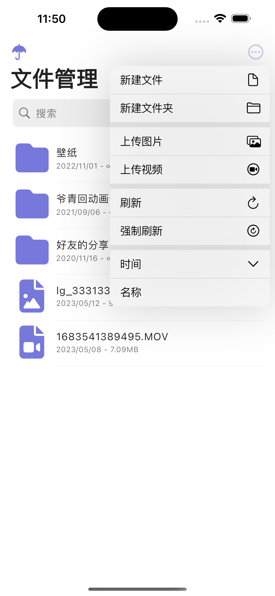
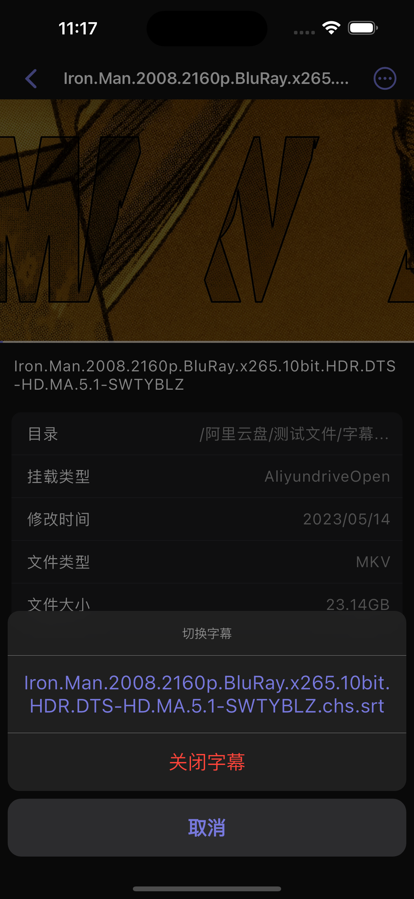
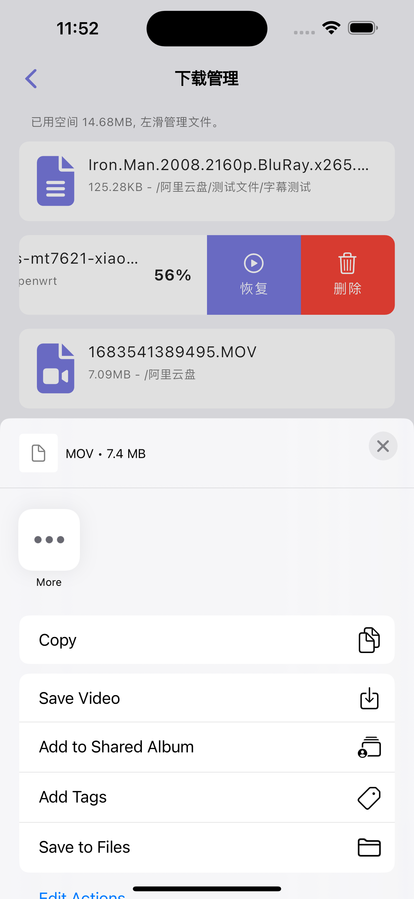
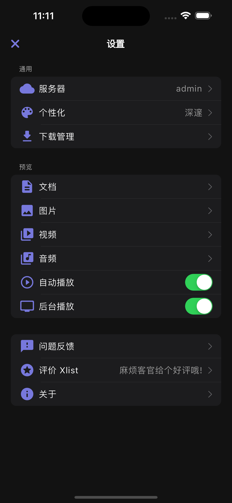

---
hide:
  - navigation
---

# 介绍

[{ width="135" }](https://apps.apple.com/cn/app/id6448833200){target=_blank}

Xlist 是一个 [Alist](https://alist.nn.ci/zh){target=_blank} 客户端，你可以在这里配置多个 [Alist](https://alist.nn.ci/zh){target=_blank} 服务器进行文件管理和预览，支持多种视频格式和文档格式的在线预览。

> - 支持文件的下载、重命名、移动和复制等功能。
> - 支持 doc、docx、xls、xlsx、ppt、pptx、pdf 等格式的文件在线预览。
> - 支持 mp4、mkv、avi、flv 等大部分视频的在线预览，同时支持 srt 和 vtt 字幕外挂。
> - 支持 jpg、png、gif 等格式的图片在线预览。
> - 文件后台下载功能，下载完成后可以用其他 App 打开预览文件。

### 屏幕截图

{ width="200" } { width="200" } { width="200" } { width="200" }
